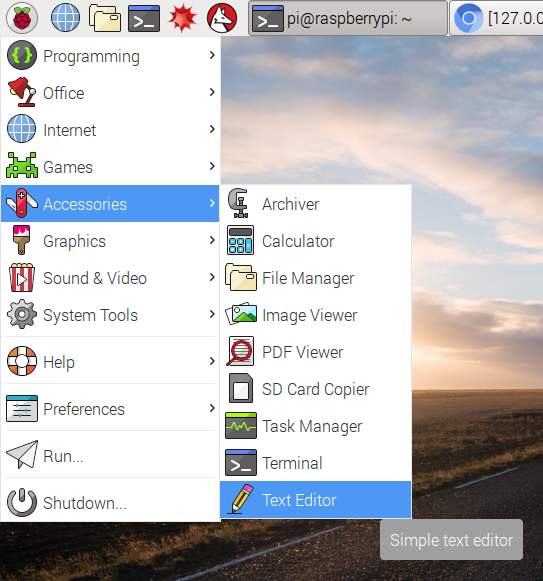
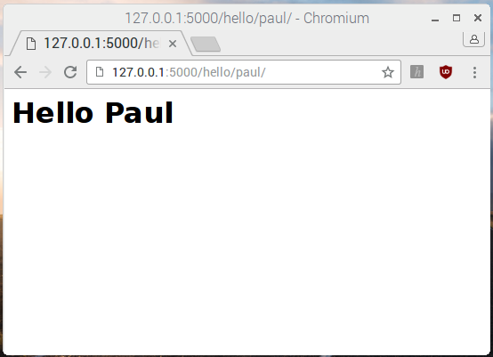

# Build a Web Server with Python Flask

How to install the lightweight web framework Flask and set up a basic web server with different pages using HTML, CSS and Python.

## Installing pip and Flask

First you're going to install the Flask package. Make sure you're online before you start.

1. Start by opening a Terminal window from the taskbar or applications menu:

    

1. Next, you'll need to install `pip` with the following command:

    ```bash
    sudo apt-get install python-pip
    ```

    *`pip` is a tool for installing Python packages from the Python Packaging Index (PyPi): you can browse packages at [pypi.python.org](https://pypi.python.org/).*

1. Now use `pip` to install Flask:

    ```bash
    sudo pip install flask
    ```

## Building a basic Flask web application

Now you're going to set up the most basic web application with Flask and Python. You will be able to run a single web page and display some text on a web browser.

1. Return to the Terminal window and create a new folder in your document called `webapp`:

    ```bash
    mkdir webapp
    ```

    *`mkdir` means "make directory": a directory is a folder, it can contain files and more folders.*

1. Navigate into this directory using the `cd` command:

    ```bash
    cd webapp
    ```

    *`cd` means "change directory": you use it to enter a folder*

1. Flask applications can be run from a single file. Now create the file now using touch:

    ```bash
    touch app.py
    ```

    This will create a file named `app.py`, in which all our application code will be written.

1. Enter the following command to open this file in IDLE, the Python editor, in order to get started writing your web app:

    ```bash
    idle app.py &
    ```

    *The ampersand (&) on the end of this command tells it to open IDLE in a new process. Unlike a command like `cd`, this command doesn't "finish" until you close the IDLE window. Opening IDLE in a new process allows you to enter more commands into the Terminal without quitting IDLE.*

1. Two windows will have opened. One is the Python shell, and the other is an empty window with `app.py` in the title bar. Click on the `app.py` window to focus on it. You'll write your application code here and any printed messages or errors will be shown in the Python shell.

1. Now enter the following lines into the blank `app.py` window:

    ```python
    from flask import Flask

    app = Flask(__name__)

    @app.route('/')
    def index():
        return 'Hello world'

    if __name__ == '__main__':
        app.run(debug=True, host='0.0.0.0')
    ```

    *Note here the `host='0.0.0.0'` means the web app will be accessible to any device on the network*

1. Save the file with `Ctrl + S`. Now return to the Terminal window and enter `python app.py` to run the web server.

    If everything has been written correctly, you should see an output similar to this:

    ```
    - Running on http://127.0.0.1:5000/
    - Restarting with reloader
    ```

1. Open the Pi's web browser from the taskbar or application menu and enter `http://127.0.0.1:5000/` - you should see a white screen with the words `Hello world`:

    

    ```python
    @app.route('/')
    def index():
        return 'Hello world'
    ```

## Adding a new route to your web app

Now you're going to add a new route to your web app, which will create another web page.

1. In a web application, a route is a certain path into your website, determined by the request sent by the user when they type it into their web browser. It's up to you which routes are enabled, and what each of them does.

    In the "Hello Raspberry Pi" example we used a single route:

    ```python
    @app.route('/')
    def index():
        return 'Hello world'
    ```

    This route is page up of three parts:

    1. `@app.route('/')` - this determines the entry point; the `/` means the root of the website, so just `http://127.0.0.1:5000/`.
    1. `def index()` - this is the name we give to the route - here it was called `index` because it's the index of the website.
    1. `return 'Hello world'` - this is the content of the web page which is returned when the user browses the index of the website.

1. Create a new route by adding the following lines below the first route:

    ```python
    @app.route('/cakes')
    def cakes():
        return 'Yummy cakes!'
    ```

1. Now navigate to your website's cake page in the browser at `127.0.0.1:5000/cakes`. You should see a webpage with the text `Yummy cakes!` on it:

    

### Add HTML templates to your web app

Next you'll modify your existing routes to return full HTML templates rather than simple text strings.

1. First create a `templates` directory in your `webapp` directory by entering this into the Terminal:

    ```bash
    mkdir templates
    ```

1. Open `Text Editor` under `Accessories` in the main menu:

    

    *This will open up a basic text editor called Leafpad*

1. Enter the following HTML code:

    ```html
    <html>
    <body>
    <h1>Hello from a template!</h1>
    </body>
    </html>
    ```

1. Save the file as `index.html` in the `templates` directory.

1. Return to your `app.py` file in IDLE and modify the first line of your code to import the `render_template` function as well:

    ```python
    from flask import Flask, render_template
    ```

1. Finally you'll need to modify your index view to return the HTML template instead of the normal text. Change the `index()` function to this:

    ```python
    @app.route('/')
    def index():
        return render_template('index.html')
    ```

    *Flask will look for `index.html` in a directory called `templates` in the same directory as the `app.py` file.*

1. Save the file. Make sure your web app is still running. If you stopped it, just run `python app.py` from your `webapp` directory.

1. Reload the route in your web browser (go to the base route at `http://127.0.0.1:5000/`) to see your new HTML template being displayed.

    

    *In this case it's not much different as all you've done is added a header, but there's plenty of scope to expand!*

## Adding colour to the web page with CSS

Cascading Style Sheets (CSS) are rules for how HTML content is displayed by the browser. Now you'll add some CSS to add colour to your web page.

1. First, return to the Terminal window and navigate to the `webapp` directory.

    *If you're still in the `templates` directory, go back up one with `cd ..`*

1. Create a new directory called `static`

1. Then open a new window with the basic Text Editor (Leafpad), or re-open the Text Editor from the menu.

1. Save the new file as `style.css` in the new `static` directory.

1. Add the following CSS rules to the file:

    ```css
    body {
        background: red;
        color: yellow;
    }
    ```

    *Note here we've used colour names: usually colours are defined by hex codes like `#ff0000` (red) but this is a simple example*

1. Save the file.

1. Now modify your HTML template to include the CSS file by adding a `<head>` tag containing a `<link>` tag with a reference to the stylesheet:

    ```html
    <html>
    <head>
    <link rel="stylesheet" href="/static/style.css" />
    </head>
    <body>
    <h1>Hello from a template!</h1>
    </body>
    </html>
    ```

1. Save the HTML file and reload the web server. You should see a colourful version of the web app!

    

Your `webapp` project directory should look something like this now:

```
├── app.py
├── static
│   └── style.css
└── templates
    └── index.html
```

If your web app doesn't look right, check you saved your CSS file in the right place.

## Adding dynamic content to a view

So far you've learned to deliver HTML template through a web server running on your Raspberry Pi. Wouldn't it be cool if you could add some dynamic content to the pages so it displayed different information? It would indeed! Large websites like Facebook, Youtube and BBC news show different content depending on the route you visit, even though the templates are very similar.

Now you'll create a new route on your website so that when you go to `http://127.0.0.1/hello/name` it will say "Hello name!" and replace name with whatever you put there. So `/hello/Paul/` will display "Hello Paul!"

1. Create a new route in your application like so:

    ```python
    @app.route('/hello/<name>')
    def hello(name):
        return render_template('page.html', name=name)
    ```

    - `@app.route('/hello/<name>')` - the `<name>` part means it pass the name into the `hello` function as a variable called `name`
    - `def name(my_name)` - this is the function that determines what content is shown - this time it takes a parameter - the given name
    - `return render_template('page.html', name=name)` - here we look up the template `page.html` and pass in the variable `name` from the URL, so the template can use it

1. Create a new HTML template called `page.html` using the Text Editor, and add the following HTML code to it:

    ```html
    <h1>Hello {{ name }}!</h1>
    ```

    *Note here we've neglected the `<html>` and `<body>` tags - this is OK for testing but real websites should have a full HTML structure*

1. Save the file, reload the web server and visit `http://127.0.0.1:5000/hello/paul` - it should look like this:

    

    Try it with different names!

What's happening here?

Flask uses `jinja`, a Python library for rendering templates. Using the curly braces on this line:

```html
<h1>Hello {{ name }}!</h1>
```

It tells the template to render the variable `name` which was passed in the route function `hello`.

What happens when you just visit `127.0.0.1:5000/hello/` without a name? Think about how you can prevent this giving an error.

## Browsing on other devices

Since we used `host='0.0.0.0'`, on the `app.run` line, the web server is accessible to any device on the same network - other computers, tablets and smartphones.

1. Enter the following command in the Terminal window to find your Raspberry Pi's IP address:

    ```bash
    hostname -I
    ```

    *You should get something like `192.168.1.3`*

1. Using another computer, tablet or smartphone, make sure it's connected to the same network as the Raspberry Pi.

1. Open up a web browser on the other device, and enter the Raspberry Pi's IP address into the address bar, with `:5000` on the end, e.g. `http://192.168.1.3:5000/`:

    

1. You should now see the web app from the other device. Try navigating to the other pages too.

## What next?

- Try adding links between pages using anchor tags like `<a href="/hello/Paul/">Hello Paul</a>`
- Add parameters to a previous route to make other views dynamic
- Add more CSS rules to each of your routes
- Learn more about HTML, CSS and web development with [Google Coder](https://www.raspberrypi.org/learning/coder-html-css-lessons/), [Mozilla Develop Network](https://developer.mozilla.org/en-US/Learn) and [Codecademy](https://www.codecademy.com/en/tracks/web)
- Learn more about Flask using the [Flask documentation](http://flask.pocoo.org/docs)
- Create a physical computing project with Raspberry Pi and use Flask to create a web interface to it (see [Matt Richardson's guide](http://mattrichardson.com/Raspberry-Pi-Flask/index.html), [BETT Bot](https://github.com/bennuttall/bett-bot) and [Energenie](http://www.pythonhosted.org/energenie/examples/web/))
- Use a Flask web app as the control panel in a home automation project - turn the lights on from your phone!
